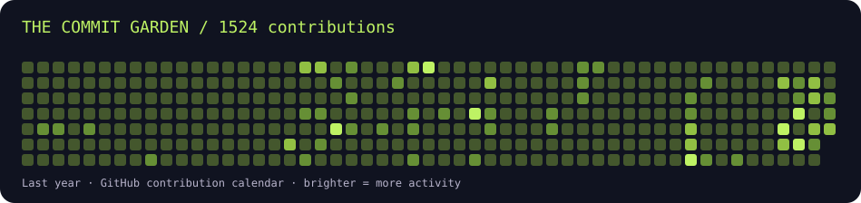

<p align="center"></p>

<p align="center"><b>Backend & Systems Engineer · Postgraduate @ PSG Tech · India</b><br/>A little chaos in the lab. A lot of care in production.</p>

<p align="center"><a href="https://tinobritty.me">Website</a> · <a href="https://linkedin.com/in/brittytino">LinkedIn</a> · <a href="mailto:brittytino08@gmail.com">Say hello</a></p>

### hey, I'm Tino 👋

I build backend-first systems, Android apps, and developer tools. Usually thinking about failure modes, readable code, and whether that abstraction really needs to exist.

```javascript
const tino = {
  building: "useful things that survive real users",
  exploring: ["distributed systems", "developer tooling", "open source"],
  defaultMode: "ship → learn → simplify",
  debugging: "one more log should do it"
};
```

**Toolbox:** Java · TypeScript · Kotlin · Python · PostgreSQL · Kafka · Docker · Flutter · Next.js

### 📡 Fresh from GitHub

<!-- LIVE:START -->
Updated **2026-09-17 UTC** · refreshed daily by my profile bot.

| Last-year contributions | Commits | Pull requests | Issues | PR reviews |
| ---: | ---: | ---: | ---: | ---: |
| 1524 | 776 | 27 | 5 | 0 |



#### ⭐ Top repositories
Public, original, non-archived projects; ranked by stars, then latest push.

| Project | What it does | Language | Stars |
| :--- | :--- | :--- | ---: |
| [psgmx](https://github.com/brittytino/psgmx) | High-performance placement portal featuring role-based access control, PostgreSQL real-time sync, and automated analytics. Powered by Flutter, Supabase, and Dart. | TypeScript | 19 |
| [patchwork](https://github.com/brittytino/patchwork) | Patchwork is an open-source Android app designed to enhance productivity and creativity. It features a modern UI, customizable tools, and seamless integration with popular platforms.  | Kotlin | 10 |
| [t\_launcher](https://github.com/brittytino/t_launcher) | Minimal Android launcher for focus and productivity | Kotlin | 8 |
| [podlink](https://github.com/brittytino/podlink) | PodLink: small accountability pods with real-time chat, streaks, crisis tools, and AI-assisted moderation/matching | TypeScript | 6 |
| [cyber-sop-assistant](https://github.com/brittytino/cyber-sop-assistant) | A fully local Cybercrime SOP assistant for India, combining a FastAPI backend, React frontend, and Ollama-powered RAG system to provide guidance, resources, and reporting workflows without cloud dependencies. | Python | 4 |

**Languages across original repos:** TypeScript (17) · JavaScript (3) · Kotlin (2) · Python (2) · HTML (1) · Vue (1). Counts are repositories, not proficiency.

#### 🔀 Recent public pull requests
- [chore(clients): suppress unavoidable X509Certificate DN deprecation warnings](https://github.com/AutoMQ/automq/pull/3582) — AutoMQ/automq · open
- [feat(windows): rank coding-agent fallback instead of declaring it](https://github.com/BasedHardware/omi/pull/12430) — BasedHardware/omi · open
- [feat: add evidence sealing support, implement CryptoJS fallback, and update seal certificate generation](https://github.com/brittytino/acpia/pull/5) — brittytino/acpia · merged
- [chore: fix docker image registry naming and standardize environment configurations in deployment workflows](https://github.com/brittytino/acpia/pull/4) — brittytino/acpia · merged
- [fix(police-console): fix TypeScript Set iteration error on Compare tab](https://github.com/brittytino/acpia/pull/3) — brittytino/acpia · merged

<sub>Contribution counts follow GitHub’s calendar rules and the workflow token’s visibility; they are not a count of every commit ever made. PRs above are the most recently updated public PRs.</sub>
<!-- LIVE:END -->

### 🧪 From the workbench

- **[rescuee](https://www.npmjs.com/package/rescuee)** — TypeScript runtime validation and structured error handling.
- **[psgmx-flutter](https://github.com/brittytino/psgmx-flutter)** — A placement portal built with Flutter and Supabase.
- **[t_launcher](https://github.com/brittytino/t_launcher)** — A quieter home screen for Android.
- **[patchwork](https://github.com/brittytino/patchwork)** — Experiments in modular architecture and refactoring.

### 📝 Build notes

[Placement portal](https://www.tinobritty.me/blog/psgmx-placement-app) · [Podlink](https://www.tinobritty.me/blog/podlink-case-study) · [Government workflows](https://www.tinobritty.me/blog/government-sop-digitization) · [Android launcher](https://www.tinobritty.me/blog/t-launcher)

---

**Found something useful?** Try it, break it, or open an issue with a good reproduction. That's a conversation I'd love to have.

<sub>Readable code scales better than clever code. · [How this profile updates itself](AUTOMATION.md)</sub>
